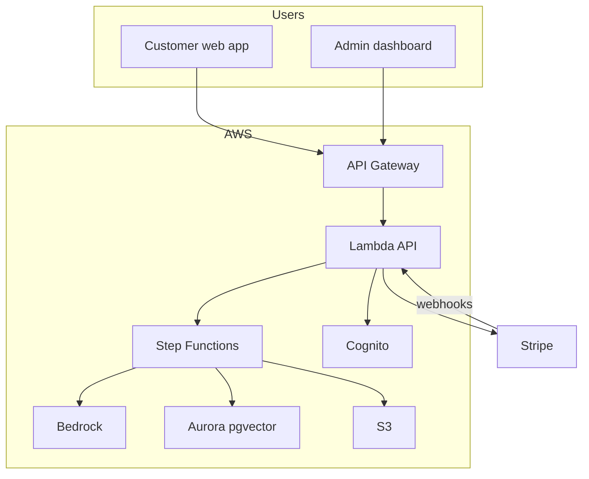
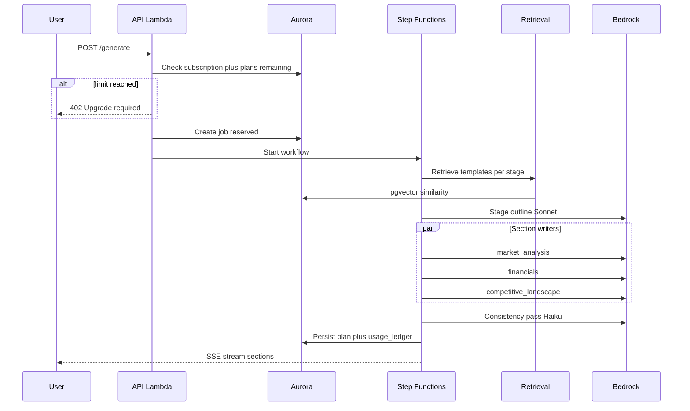

# Build-Block Architecture

AI-powered business plan generator with proprietary template RAG, subscription billing, and cost-minimized AWS infrastructure.

## System context



## Generation pipeline



## Monorepo layout

```
apps/web/          Next.js customer app + admin
apps/api/          Python Lambda handlers + pipeline
infra/cdk/         AWS CDK stacks
corpus/templates/  Proprietary template source files
database/          SQL schema
scripts/ingest/    Corpus ingestion CLI
packages/pipeline/ Shared JSON schemas
```

## Subscription tiers (initial)

| Tier | Price | Plans/month | Export |
|------|-------|-------------|--------|
| Free | $0 | 0 (preview only) | No |
| Starter | $24/mo | 3 | PDF |
| Pro | $59/mo | 10 | PDF + DOCX |
| Business | $129/mo | 30 | PDF + DOCX + priority |

## Free tier behavior

- Full intake wizard
- Generate **one preview section** (executive summary)
- Watermarked output, no PDF/DOCX export
- CTA to subscribe for full plan

## Cost controls

1. Haiku for outline enrichment and consistency; Sonnet for section writing
2. Aurora Serverless v2 min 0.5 ACU
3. Lambda outside VPC initially (RDS Data API or public Aurora endpoint)
4. No OpenSearch until corpus scale demands it
5. Retrieval interface abstracted for future migration

## Security

- Corpus chunks never returned to client (server-side RAG only)
- S3 corpus bucket private, IAM role per Lambda
- Presigned URLs for exports (15 min TTL)
- Rate limits: 3 concurrent jobs per user
